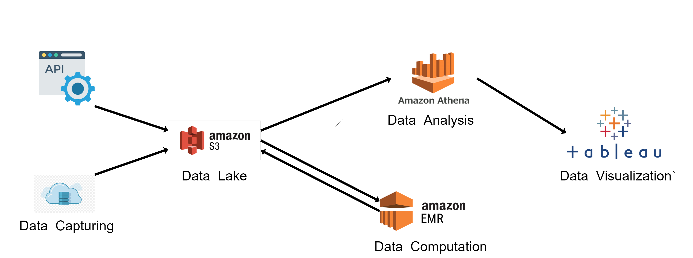

# Covid-19 Aviation Analysis

### Team Members:
- Dhruv Patel
- Himalya Bachwani
- Kishan Thumar
- Rahil Balar

### Data Pipeline: 

### Project Working:

### Dataset:

### Tableau link of our project:
https://public.tableau.com/app/profile/dhruv4657/viz/Covid-19AviationAnalysis/Airline-Covid
https://public.tableau.com/app/profile/himalya1749/viz/CovidAviationUSAnalysis/Dashboard2

### Steps to run the project:
1. Get the input files using the dataset link provided.
2. Download all *.py files and create config.py file with the key mentioned in report.
3. 

